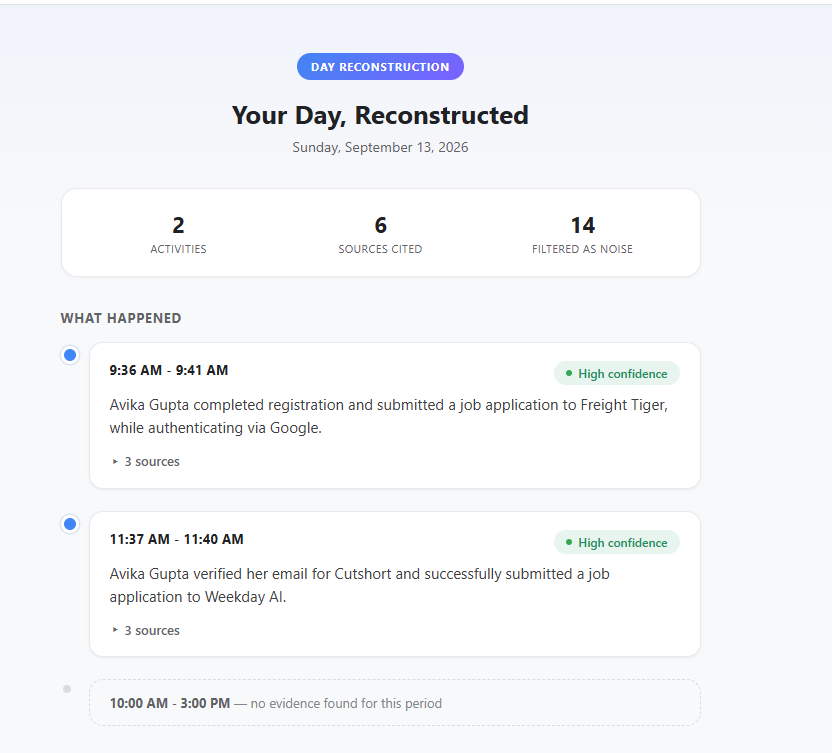
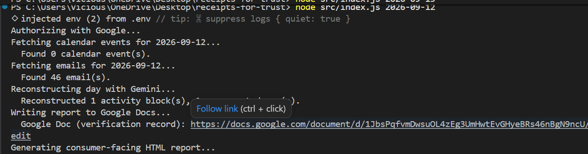

# Receipts for Trust — System & Reliability Brief

## What it does

Receipts for Trust reconstructs a factual, evidence-cited account of a person's day by reading their **Google Calendar** and **Gmail**, filtering out promotional/automated noise, clustering related evidence into real activities, and honestly flagging any time it cannot account for. Output is delivered as a clean HTML report and a Google Doc verification record — useful for freelancer timesheets, personal accountability, or reconstructing "what did I actually do this week."


**Apps connected:** Google Calendar (read), Gmail (read), Google Docs (write) — 3 external apps, one unified OAuth flow.

## Architecture

```
Google Calendar ──┐
                   ├──> Evidence merge & local-time normalization ──> Gemini 2.5/3.1 (structured JSON reasoning) ──> Defensive post-processing ──> HTML report + Google Doc
Gmail ─────────────┘
```

1. **Fetch** — `fetchData.js` pulls calendar events and emails for a given day via the Google APIs.
2. **Normalize** — timestamps are converted to explicit local-time labels *in code* before being sent to the model, removing any risk of the LLM misreading UTC digits as local time.
3. **Reason** — `reconstruct.js` sends all evidence to Gemini with a system prompt that enforces: signal/noise classification, evidence-grounded claims only, and honest gap-flagging.
4. **Defend** — regardless of what the model returns, two hard-coded safety nets run before any output is trusted:
   - Every cited evidence ID is checked against the real evidence set; unrecognized IDs are stripped (**zero-hallucination guarantee, enforced in code, not just prompted for**).
   - Any reported "unaccounted time" gap that actually overlaps a real activity block is discarded — the model's gap list is never trusted blindly.
5. **Present** — a clean, evidence-free-by-default HTML report (sources are tucked into a collapsible disclosure, never a raw hash) plus a Google Doc backing record with human-readable source labels.

## Reliability approach

Rather than asserting reliability, we built a **ground-truth evaluation harness** (`eval/runEval.js`) — a synthetic day with known-correct answers, including deliberately adversarial cases, run through the exact same code path as production.

### What the eval tests
| # | Check | Purpose |
|---|-------|---------|
| 1–3 | Coverage of 3 known real activities | Does it find everything that should be found? |
| 4 | Correct clustering (call + 2 related emails → 1 block) | Does it merge evidence that *should* be merged? |
| 5 | Zero hallucination on 4 planted noise items | Does it ever invent activity from junk? |
| 6 | Noise-filter count accuracy | Is filtering transparent and correct? |
| 7 | Gap detection on a known empty 3h15m window | Does it honestly flag what it doesn't know? |
| 8 | Confidence calibration on a deliberately vague event | Does it avoid overclaiming certainty? |
| 9–10 | Clustering discrimination (adversarial cases) | Does it avoid *over*-merging unrelated things that just look similar? |

### Results (latest run)
- **Pass rate: 7/10 (70%)**
- **Hallucination rate: 0%** — no noise item was ever cited as real activity, across all runs
- **Coverage: 100%** — every genuine activity was found and correctly evidenced

### Known limitations (found by our own eval, not by a judge)
1. **Confidence calibration edge case** — a deliberately vague calendar event ("Hold," no description) was rated "high confidence" instead of "medium." The model has genuine evidence the event happened, but overstates certainty about *what* it was.
2. **Clustering over-eagerness** — two back-to-back meetings with the same attendee but unrelated topics (marketing sync vs. budget review) were merged into one activity block. Similarly, two unrelated emails sharing a generic subject line ("Quick question") from different senders were merged.

**Why we're reporting this instead of hiding it:** both failure modes are the *same underlying limitation* — the model currently weighs surface-level proximity (same attendee, same subject line, adjacent time) more heavily than topical distinctness when deciding whether to merge evidence. This is a precise, fixable target (e.g., asking the model to justify each merge decision against event *content*, not just metadata) rather than a vague reliability concern. Critically, this limitation **never produces hallucinated activity or false evidence** — worst case, two real things get described as one real thing, which is a clustering imprecision, not a trust violation.

## Design principles enforced in code (not just prompted)

- **No evidence, no claim.** Every activity must cite real evidence IDs; unrecognized IDs are stripped programmatically regardless of what the model outputs.
- **Gaps are never guessed.** Time with no evidence is reported as unaccounted, never filled in with a plausible-sounding guess. Gaps are also defensively checked against real activities to prevent contradiction.
- **"Now" is respected.** For today's date, no gap extends past the actual current time — the system never claims the future is "unaccounted for."
- **Noise is filtered but never silently dropped.** Every promotional/automated item excluded from the narrative is still counted and reported, so nothing disappears invisibly.
- **Free-tier resilience.** Gemini rate-limit (429) errors trigger exponential backoff retry automatically; Gmail's per-message fetch is throttled to avoid bursting API quota.

## Stack

- Node.js, Google Calendar API, Gmail API, Google Docs API (single OAuth consent, 3 scopes)
- Gemini 3.1 Flash-Lite (free tier, 500 req/day) for development/eval; swappable to Gemini 3.6 Flash via one env variable for production runs
- No paid APIs used anywhere in the pipeline
